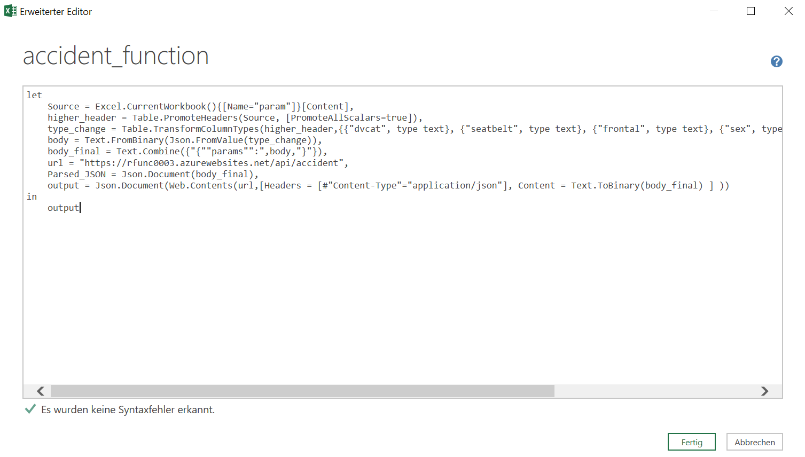

# Excel Frontend

As David pointed out it is possible to access this endpoint by many different ways not just Shiny. 

## curl POST

This first one is very simple and another bash command, i.e. `curl`: 

```bash
curl -i -X POST -H 'Content-Type: application/json' -d '{"params":[{"dvcat":"1-9km/h","seatbelt":"none","frontal":"notfrontal","sex":"f","ageOFocc":72,"yearVeh":2002,"airbag":"none","occRole":"driver"}]}' https://$FR_FUNCTION.azurewebsites.net/api/accident
```


As you can see our `POST` call gets a successful `200` HTTP-response and a value of `0.0076`. All the parameters are sent via the body (`-d` = data) and encoded in JSON. 

## Excel

Many users might not find the Shiny interface the most convenient one to work with. Often the calculated value is just another input in a calculation and needs to be processed further. Excel is more often than not the logical next steps for many users that are not coders. This is why I wanted to provide the same user-friendly UI as Shiny and still be able to directly plug the value into the next calculation. 

The following shows how Excel can be used to work just the same as Shiny: 


You can download the file [here](images/accidents.xlsx). However, as the function will not be active do not expect it work directly. You will have to replace at least the URL endpoint within the M code. 

### User interface

The UI is just a quick replication of David's shiny interface. It has all the necessary parameters including a check for allowed user input (more about [data validation](https://support.microsoft.com/en-us/office/apply-data-validation-to-cells-29fecbcc-d1b9-42c1-9d76-eff3ce5f7249)). Simply selected the proposed inputs or enter a valid age or year and then hit the "Refresh" button just as you can see above.  

I set up a little, hidden helper sheet to have an overview of the parameters as well as the respective allowed inputs. It is in horizontal form because this way it is easier to process in the next step. 

### Power Query and some M code

The entire logic is done in Power Query using the [M formula language](https://docs.microsoft.com/en-us/powerquery-m/). It only took these few lines: 

```m
let
    Source = Excel.CurrentWorkbook(){[Name="param"]}[Content],
    higher_header = Table.PromoteHeaders(Source, [PromoteAllScalars=true]),
    type_change = Table.TransformColumnTypes(higher_header,{{"dvcat", type text}, {"seatbelt", type text}, {"frontal", type text}, {"sex", type text}, {"airbag", type text}, {"occRole", type text}}),
    body = Text.FromBinary(Json.FromValue(type_change)),
    body_final = Text.Combine({"{""params"":",body,"}"}),
    url = "https://yourfunctionnamehere.azurewebsites.net/api/accident",
    Parsed_JSON = Json.Document(body_final),
    output = Json.Document(Web.Contents(url,[Headers = [#"Content-Type"="application/json"], Content = Text.ToBinary(body_final) ] ))
in
    output
```

First of all, it extracts the user input and processes it until we have reached the desired `JSON` format. 
Our created enpoint is also hard-coded in there as it should not change too often once it is set up properly. You will have to replace "yourfunctionnamehere" with your chosen name. 
The very last line sends the `HTTP-POST` call including the parameters in JSON-body and returns the response: 

It strongly recommend using the "Advanced Editor" in which this can simply be copied. It is then converted line by line into single process steps. If errors occur just work through the steps sequentially. 



In the end Power Query should look something like this and return calculated percentage: 


(sorry for all the screenshots being in German)

## Next Steps

**Power BI**

As MS Excel and MS Power BI share the components [Power Query](https://powerquery.microsoft.com/en-us/) and [Power Pivot](https://support.microsoft.com/en-us/office/power-pivot-overview-and-learning-f9001958-7901-4caa-ad80-028a6d2432ed), we could easily do the exact same thing in Power BI. 
